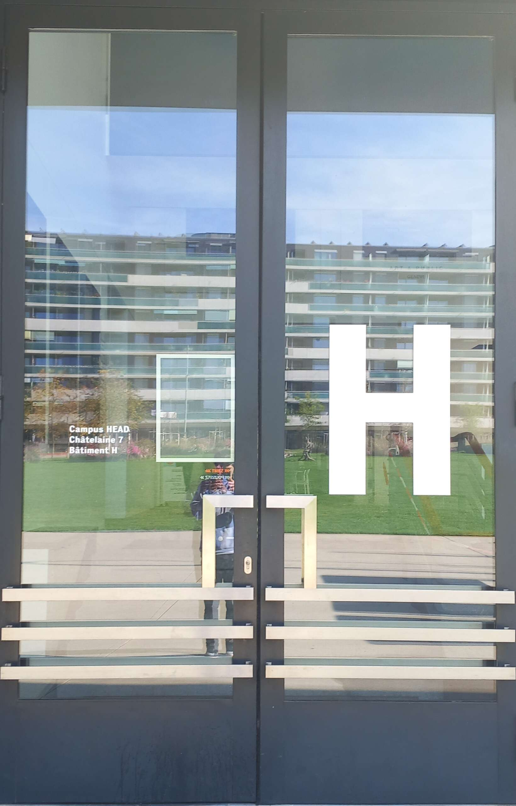

# Between recurring situations, routine and time loops

- Recurring situations allows for reflexivity on one's actions to learn lessons. Especially in social interaction contexts, going back in time would allow us to repair mistakes.

- Routine is reassuring, restful and comfortable, but also boring.
Routine is broken through new experiences.

- A feeling of time loop appears when there are repetitions in one's actions over time despite a context that may change (work/school), but on the other hand a real time loop would be a great way to experiment (GTA, choice game).

→ The story could be about someone trying to balance their routine throught trial and error.

  

