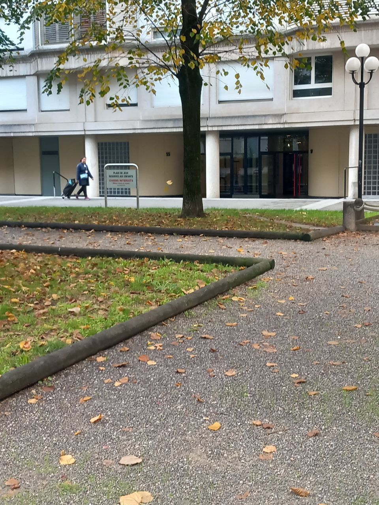

# A double edged sword
(*Based on [these interviews](../process/2022-11-02-observations.md#interviews)*)

On the one hand, routine can be a positive thing in the sense that it allows you to be less stressed, to feel safe, to preserve your mental resources. On the other hand, sinking too deeply into one's routine can make life monotonous, cut off the desire to leave one's comfort zone, reduce one's creativity or lead to the repetition of unhealthy behaviors.

A world where each person has to find a balance between the two forces (routine and novelty) with which they will tint what makes up the world through their eyes.

 

  

 

