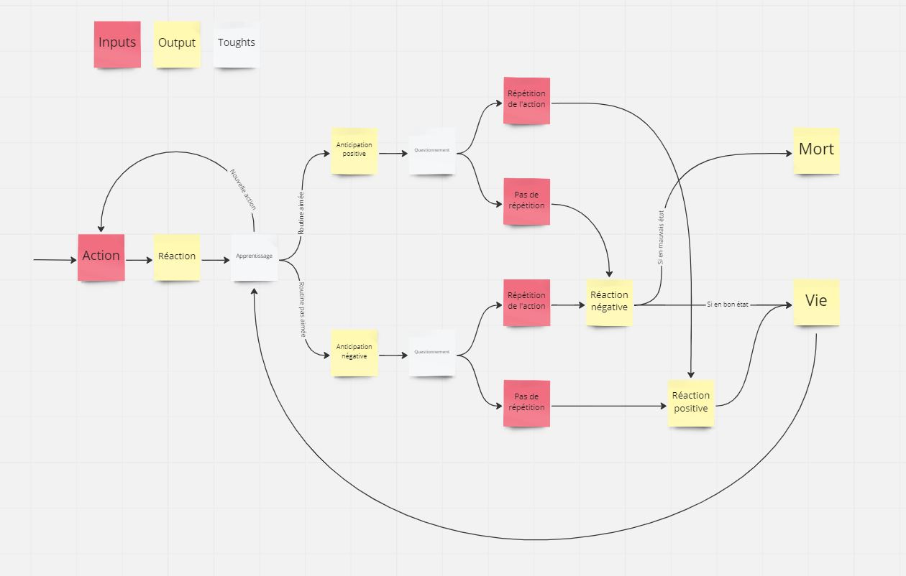

# It and I

## Pitch

*Routine shapes the way we live our lives, but in a sense it is imposed on us by external causes; it does not necessarily result from conscious and deliberate choices.*

A being observes my actions and interactions with the real world on a daily basis and over time integrates my routines. It expresses its personal preferencies through behavior in anticipation or in reaction to my actions. Its state depends on me. Am I ready to change my habits to make him happy or will I continue as I want to at the risk of making his life with me a hell or worse?

## Twine prototype
[Here](../prototypes/twine/It_and_I-v3.html) it is!

## Object research
[Here](../process/2022-12-06-object-research.md) it is!

## Concept research
[Here](../process/2022-12-04-concept-research.md) it is!

## Storyboard
[Here](../process/2022-12-13-storyboard.md) it is!

## Storylet

 

