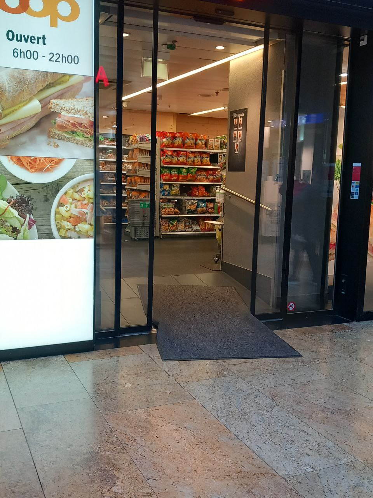
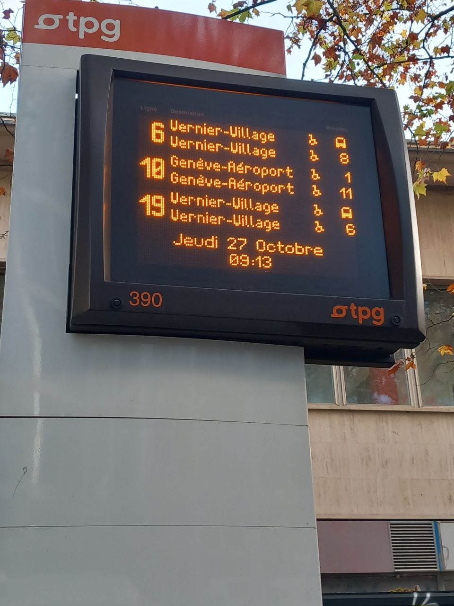
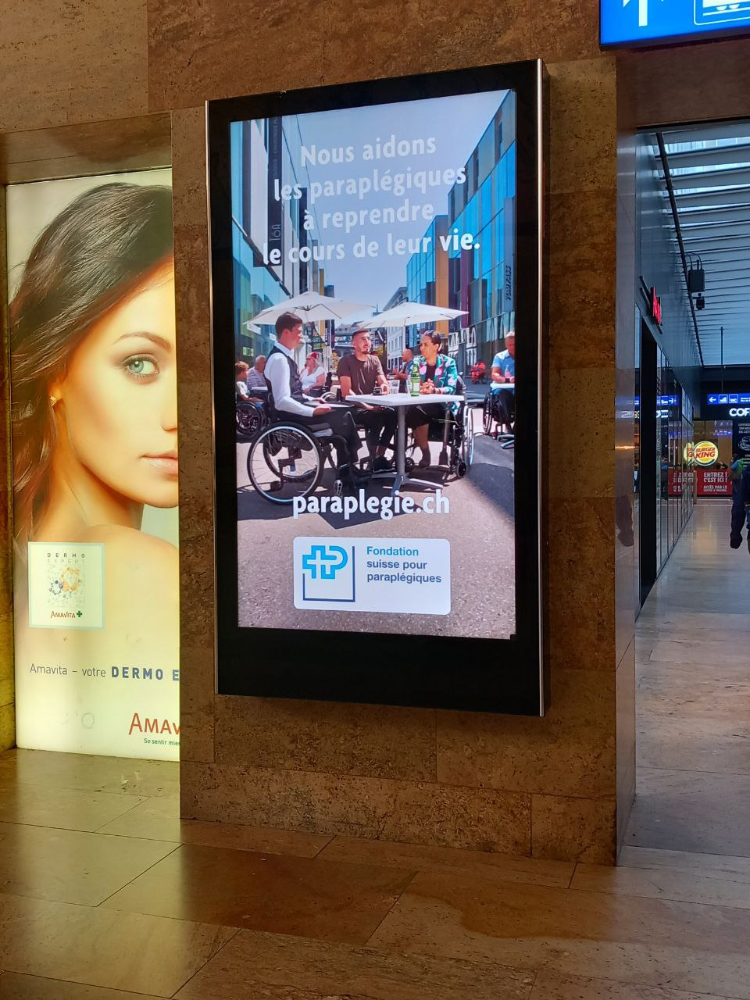
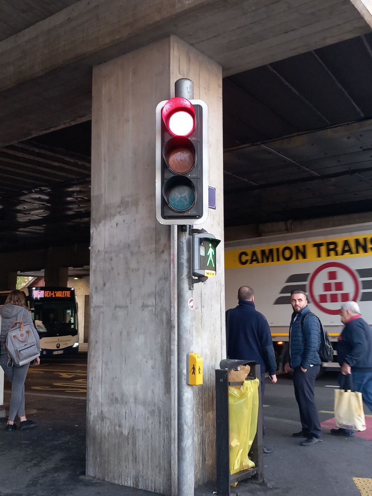
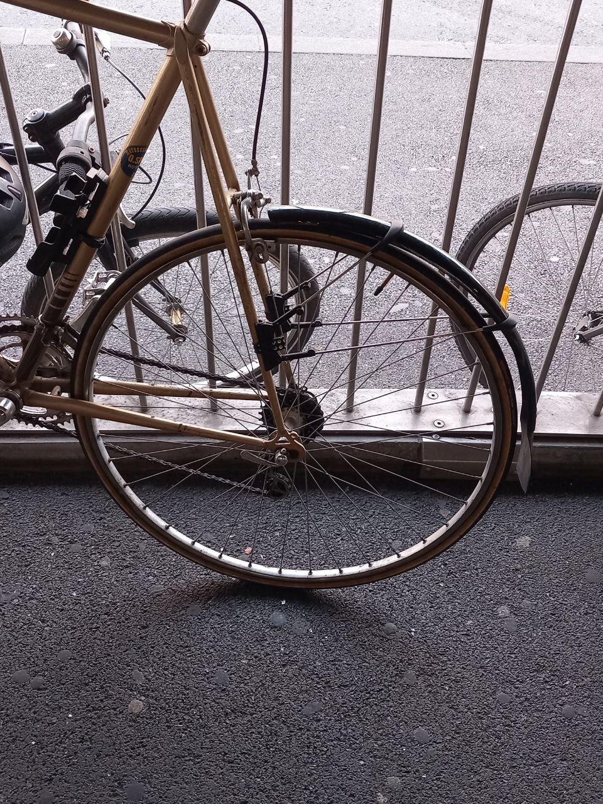

# Observations

## Interviews

### Recurring situations

**Describe a situation when you felt you experienced it already multiple times?**

> Le changement d’appartement: refaire tous les formulaires, demander à la commune les certificats, etc… Je dois encore le refaire, mais je savais déjà comment ça marchait. 

> Pour des choses du quotidien, genre ma mère qui me parle des choses et on est assis exactement aux mêmes places, il y a les mêmes odeurs, etc...

> C'est pas un truc qui arrive souvent, mais par exemple j'ai parfois l'impression que l'année que je suis en train de vivre c'est la même qu'une autre mais évoluée. C'est comme le niveau 2 de la même année, genre aux Beaux Arts c'était comme mes années de collège mais plus évolué.

> Tous ce qui est situations social où tu dois sociabiliser pour la première fois avec des gens, surtout quand ils sont pas très sympas.

**In which way has there been an learning process? Did you approach it differently the next time it occured?**

> Bah si la première fois j’ai fait des erreurs, j’ai appris des choses et j’ai pu y remédier dans les expériences suivantes. Je savais aussi combien de temps prenait les choses à faire. J’étais plus préparée, j’arrivais avec un autre mood, ça me stressait moins car j’y avais déjà été controntée.

> Non, j'ai accepté que les choses soient comme elles sont.

> Oui, j'ai appris à voir ce qui était faisable socialement ou pas et du coup j'essaie d'apprendre comment les gens réagissent, quels sujets leurs parlent, etc... Aussi, au collège y'a ce truc où tu veux faire comme les autres et en grandissant tu finis par t'en foutre et être toi-même.

**Are there situations you wished you could reexperience to act differently? How would it be different?**

>  L’adolescence entière (rires). Des occasions sociales où j’ai fais des erreurs en parlant de choses que j’aurais pas dû. Après t’apprend que y’a différentes manières de faire. Quand t’es ado, t’as pas toutes les clés sociales, tu sors de ton cercle familliale et tu dois encore apprendre à vivre. Quand tu rentres dans la 20aine, tu es bête, j’aurais envie de me frapper. J’aurais voulu avoir un guide plus accessible n’ayant pas de frères ou de soeurs.

> Tous ce qui est tests et contrôles à l'école, des choses que j'ai dis à des gens où je me dis que j'aurais pu faire différemment. Aussi en dessin, après avoir posté quelque chose ou considéré que c'est fini, j'me disais que j'aurais pu faire différemment.

> Oui, mais que sur des trucs bêtes. Sur les gros évènements je me dis que c'est comme ça, mais sur des petits trucs, j'ai envie de me corriger si j'ai dit des trucs faux ou fait des erreurs.

> Toutes les situations sociales du collège. Quand t’as de l’anxiété et que tu rentres chez toi après avoir passé un moment avec des gens et que tu te dis que ce tu as dis était trop ridicule, après tu prends la mauvaise habitude de te dire ça même quand y’a pas de raisons.

### Routine

**In which situations do you find yourself in a routine?**

> J’ai la routine du soir où je me sens mal à l’aise si je le fais pas. Je me douche, brosse les dents, skincare, bois un verre d’eau. Ca me dérange d’aller au lit sans avoir fait ça, du coup je me sens un peu coincé dans cette routine. Je me sens coincée dedans car si je le fais pas ça m’embête, je me sens pas bien, mais d'un autre côté ça m’embête pas de le faire.

> Je pense à partir du moment où ça fait ~deux semaines que je fais la même chose tous les jours.  Par exemple aller sur la terrasse, je le faisais pas avant et depuis la rentrée si, c’est mon nouveau lieu de pause, ma nouvelle routine.

> Moi j’ai tendance à éviter la routine à tout prix sinon j’ai l'impression que le temps m’échappe, j’essaie de casser mes habitudes, de changer mes trajets, pas manger aux mêmes heures, sinon je perds la notion du temps qui passe.

> Je fonctionne avec des routines pour me repérer dans le temps. Sauf qu’à un moment j’en ai marre car j’ai envie de nouveautés. Par ex, prendre les mêmes trajets, acheter les mêmes choses à manger à cause des mes allergies, car c’est reposant pour l’esprit, aussi pour des réperages spaciaux et temporels.

**How do you feel about being in a routine?**

> Tu sors pas de ta zone de confort, mais dans un sens ça permet de développer un bien-être, tu te stress pas à aller dans tous les sens, demander à trucs à des gens. Tu arrives à t’organiser toi-même car tu sais exactement ce que tu fais.

> C’est à la fois rassurant et ennuyeux. Ca me fait perdre la mémoire, dans le sens où c’est des gestes qui sont très mécaniques, je fais pas attention et donc j’perds beaucoup plus de choses que par exemple en voyage ou je perds beaucoup moins.

> Je me sens pas bien. J’ai l’impression que les moments sont dissociés les uns des autres. J’ai pas envie de ressentir tous les moments de la même manière.

> Je peux le vivre très bien, notamment dans des espaces qui sont pas les miens, ça me permet de me réperer et ça me permet de m’accorder aux autres quand il y a une routine. Mais à la long c’est chiant et t’as envie de changements.

**In which way do you find enjoyment in the routine?**

> C'est une zone de confort, je peux le faire sans penser à avoir le faire. Je fais les choses par défaut. J’ai lu qu’une routine prend 28 jours pour habituer ton corps à le faire sans y penser.

> J’adore le rythme qu’on a entre teuf et pauses. Aussi, c’est toujours le même ordre des choses, par exemple je rentre, je vois mes parents, on fait à manger, on boit une tisane, etc… 

> Ca ne m'arrive pas vraiment. Y’a des moments où j’ai quand même envie de me retrouver dans des endroits avec des gens que je connais car c’est rassurant, mais j’ai pas envie d’être dans une routine permanente.

> J’ai tendance à trop réflechir. Une routine me permet d’éviter des efforts mentaux. Mais quand la routine est trop présente, t’as l’impression que ça a pas de fin.  Ca permet d’aller en mode automatique.

**What do you do to break the routine?**

> J'ai plutôt une routine positive donc j'ai pas envie de la casser. C’est juste quand je suis fatiguée que je le fais pas. D’un autre côté j’ai des mauvaises habitudes, mais c’est pas la même chose. Si je devais le faire, je ferais un calendrier avec des cases à cocher pour les jours du mois où je peux tenir compte de si j’ai fais les choses ou pas, ça me ferait plaisir d’avoir coché toutes les cases.

> Avant je jouais tous les soirs, je me suis rendue compte depuis un mois que je faisais plus ça alors que c’était hyper régulier pendant 2 ans. C’est juste apparu comme ça, j’avais juste plus envie.

> Faire les mêmes choses différemment.

> Je tente un nouveau truc, par exemple un nouveau truc à manger. Sinon je regarde sur Internet si là où j’habite il y a des choses funs à faire comme un musée.

### Time loops

**In which situation or moment in your life you felt stuck in a time loop?**

> Pendant mon stage de cet été. Chaque semaine il y avait une nouvelle statégie, je devais tout changer. Mais chaque semaine je devais refaire la même chose mais avec un autre sujet. Je me sentais vraiment coincée dedans, car le changement dépendait pas de moi. Je pouvais rien faire à part démissionner.

> Dans les moments de routine, quand ça se ressemble trop. Ca dépend de l’échelle aussi, j’ai l’impression que ces trois dernières années de Cachelor ça se ressemblait beaucoup, mais j’irais pas jusqu’à dire que c’était une boucle temporelle, plus un cycle.

> Boucle temporelle pas vraiment, mais avoir l’impression d’être dans un décor pendant des crises d'angoisse, que les choses autour de toi sont pas réelles et ça donne un peu ce côté irréel où je sens pas vriament d’encrage de le temps, mais sans être une boucle.

> Typiquement quand t’es dans la même école pendant des années, t’as l’impression que ça se termine jamais, que tu vois toujours les mêmes gens, surtout quand tu les aimes pas. Aussi, l’été, à la campagne tu vois pas beaucoup de gens donc t’as l’impression que tu vas jamais sortir de la campagne.

**If you had the power to trigger a time loop, which would it be and what would you do?**

> La journée parfaite, je construirais ma journée de manière parfaite et je la ferais boucler, ça serait le rêve. Par contre, je pouvais faire aucun choix pendant cette journée ça serait un enfer.

> Je prendrais une journée normale et je ferais tout ce que je me permetterais pas de faire avec les conventions sociales ou physiques, genre sauter de la fenêtre. Comme être dans GTA pendant une journée.

> Je le ferais pas.

> Je ferais comme un jeu à choix, je verrais quelles interactions ont changées ou pas, un peu en mode bonne réponse.

## Medias
- Played [Every day the same dream](https://www.molleindustria.org/everydaythesamedream/everydaythesamedream.html) by [MOLLEINDUSTRIA](https://www.molleindustria.org/)

## Articles
- *“Live - Die - Repeat”. The Time Loop as a Narrative and a Game Mechanic*, Linda Lahdenperä

## Photos

  
  
  
  
  