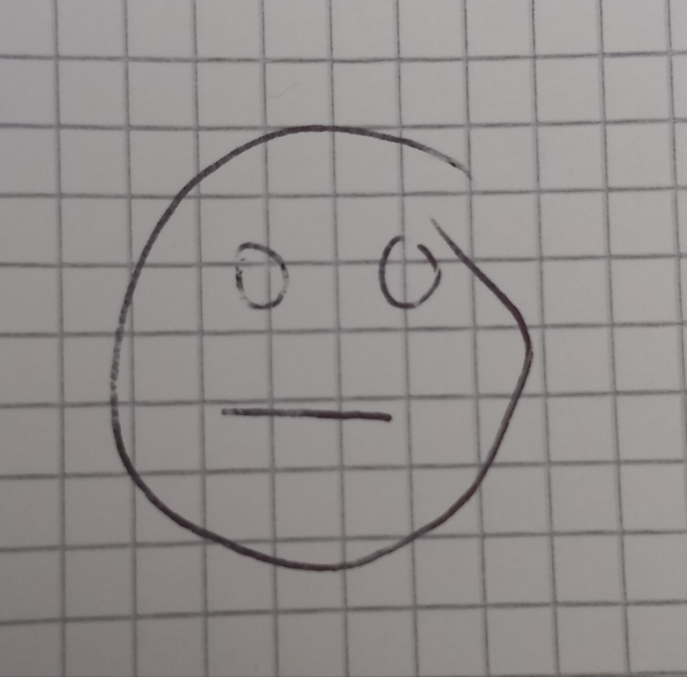
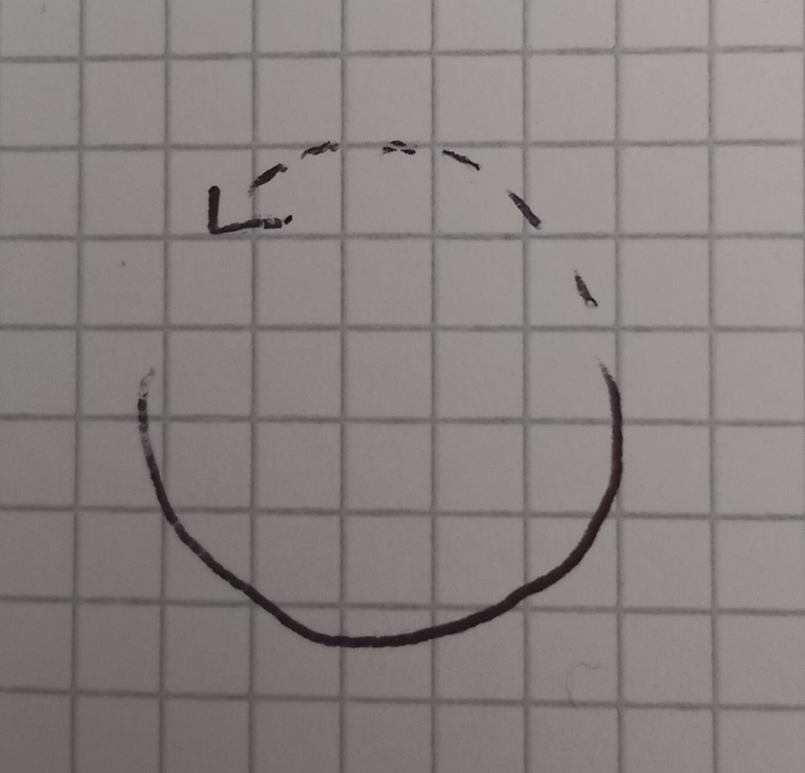

# Observations

## Interviews

### Routine

**Citez trois raisons pour lesquelles la routine est quelque chose de positif pour vous?**

> pas d’imprévus, plus facilement prévoir car pas besoin de penser aux trucs élémentaires, réconfortant

> gestion du stress plus facile, fait apprécier les choses du quotidien, plus facile de s’organiser, pas beaucoup de temps de cerveau

> sécurité, organisation, repos

> la routine est plus facile à gérer, plus de temps pour réfléchir, pas de stress

**Citez trois raisons pour lesquelles la routine est quelque chose de négatif pour vous**

> mauvaise perception du temps, ta vie est toujours la même, ennuyant, monotonie

> peu couper l’envie de sortir de sa zone de confort, peut perpetuer un comportement malsain, ennui

> ennui, baisse de créativité, appauvrissement culturel

> ennuyant, pas stimulant, pas de surprises

**Citez trois manières de briser la routine**

> changer de trajet, changer l’ordre des ordre, changer les endroits

> tenter de nouvelles choses, remettre la routine en question, la faire à l’envers

> être désorganisé, ne pas prévoir les choses, faire les choses d’une nouvelle manière

> faire des sorties dans des lieux nouveaux, rencontrer des gens, changer de chemin

**Citez trois lieux que vous associez à la routine**

> la maison, l’école et les gares

> le train, la salle de bain, l’ascenceur

> train/gare, maison, café 

> escaliers, maison, ascenceur

**Citez trois lieux que vous associez à l’absence de routine**

> la forêt, les terrains de sport et Marseille

> parc d’attraction, ski, plage

> restaurant, rave, aéroport

> Sahara, rue, fond du lac Léman

**Citez trois objets que vous associez à la routine**

> les casseroles, les housses de couette, les rideaux

> réveil-matin, brosse à dent, sac à dos

> brosse à dent, gobelet de café, téléphone

> lit, évier, mirroir

**Citez trois objets que vous associez à l’absence de routine**

> les clés, les portefeuilles, les distributeurs de billets

> écharpe, pomme, roller

> drogue, musique, jeux

> scalpel, piment (en bonne santé), billet de 500

## Drawings

  
  
  

  ## Midjourney

  
  
  
  
  