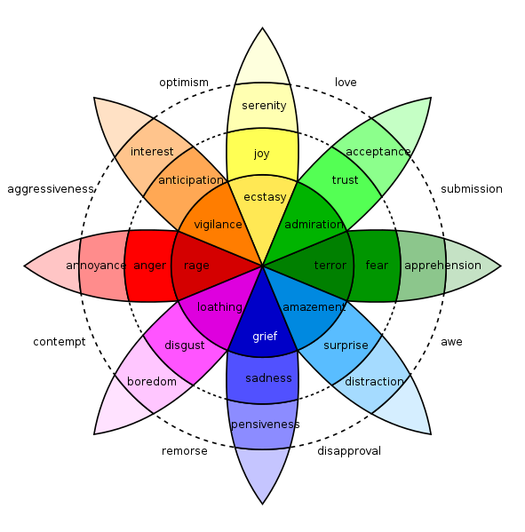
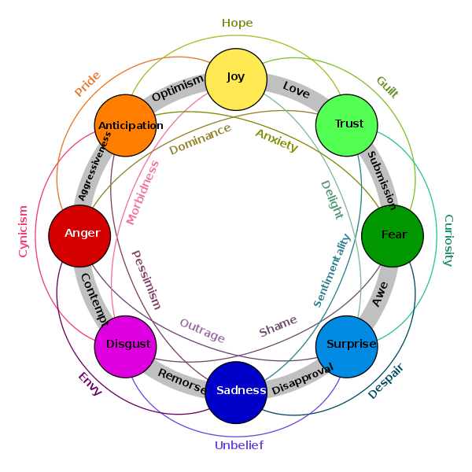
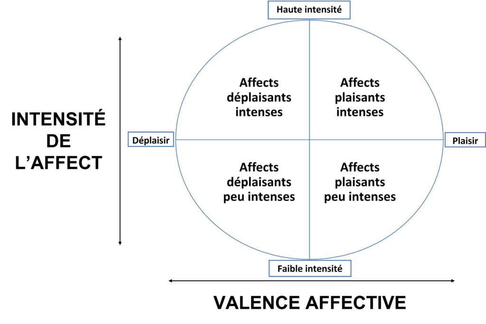
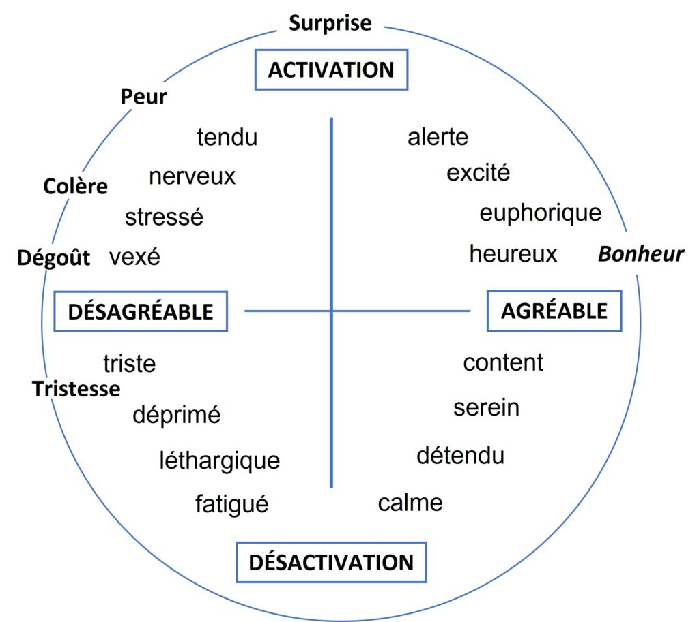

# Concept research
*[< **It and I** pitch](../pitches/2022-11-28-pitch.md)*

## Concept

- A being which accompagny me observes my actions on a daily basis and over time integrates my routines.
    
    → mouvement recognition
    
- It expresses its personality through behavior in anticipation or in reaction to my actions.
    
    → vibration (actions are meaningful) : anticipation and reaction
    
    → light (action have consequences) : general state
    

## Reflection Mechanics

1. Observe routines
    
    → anticipate (positive or negative) inputs (if integrated)  : please don’t do this or please continue to do this
    
    → react (positive or negative) to inputs (at any time)
    
    → integrate routines (after some time)
    
2. Has preferences
    
    → like randomly selected actions (?) at set hours (?) per default
    
3. Can be happy or die
    
    → has a global state
    
    → actions that fits goes towards happiness (continue to play)
    
    → actions that doesnt fit goes towards death (end of game)

## Gestes/moments de routine
*(à un moment donné)*

- Participation à un cours donné (à l’école)
- Participation à un sport (course, foot, basket, combat)
- Brossage de dents
- Douche
- Course pour arriver au train
- Marche pour arriver au train
- Fumer
- Aller acheter à qqch qqpart
- aller au lit
- Travailler/étudier
- Prendre une pause qqpart
- Faire un trajet
    - Bus
    - Train
    - À pied
    - En voiture
    - Vélo
- Acheter les mêmes choses à manger
- Manger
    - Déjeuner
    - Souper
    - Diner
- Boire
    - une bière
    - un café
- Jouer à un jeu (?)
- Écouter la radio (?)
- Être avec qqun (?)
- Aller aux toilettes (?)
- Ouvrir une porte
- Utiliser pc
- Utiliser téléphone
- Tapper sur un clavier
- Croiser les bras
- Ramasser quelque chose
- S’asseoir/se lever
- Regarder la TV
- Faire le ménage
- Téléphoner
- Lire
- S’occuper d’un animal de compagnie
- Sortir les poubelles
- Conduire
- Faire une sieste
- Faire du rangement
- Se relaxer/méditer
- Cuisiner

## Emotions

**La roue des émotions (ou modèle « circumplex ») de Robert Plutchik**

1. Anger: A strong, intense feeling of annoyance, displeasure, or hostility that could be expressed through rapid, forceful vibrations.
2. Fear: A feeling of anxiety or unease that could be expressed through fast, shaky vibrations.
3. Joy: A feeling of happiness or delight that could be expressed through light, bouncy vibrations.
4. Sadness: A feeling of sorrow or melancholy that could be expressed through slow, heavy vibrations.
5. Disgust: A feeling of revulsion or distaste that could be expressed through sharp, repulsed vibrations.
6. Surprise: A feeling of shock or amazement that could be expressed through sudden, startled vibrations.
7. Anticipation: A feeling of expectation or anticipation that could be expressed through quick, eager vibrations.
8. Trust: A feeling of confidence or reliance that could be expressed through steady, reassuring vibrations.

**Le modèle bi-dimensionnel de Russel**

- **deux axes** uniquement seraient nécessaires : les dimensions de **valence** (plaisir/déplaisir) et d’**activation** (faible/forte), qui représentent l’affect en tant qu’expérience subjective sur un continuum
- La dimension horizontale de **plaisir** intrinsèque, appelée *valence*, se définit sur un ***continuum déplaisir-plaisir***. Elle correspond au *degré de satisfaction* et *de bien-être* du sujet, c’est-à-dire une *qualité hédonique* (agréable ou désagréable) ;
- La dimension verticale d’**activation**, appelée *degré ou niveau d’intensité*, *d’activation ou d’éveil* se définit sur un ***continuum calme-excitation***. Elle fait référence au *degré d’éveil du sujet*. Plus l’intensité des émotions est faible, plus elles deviendraient difficiles à identifier.

→ Intensité X type de vibration?