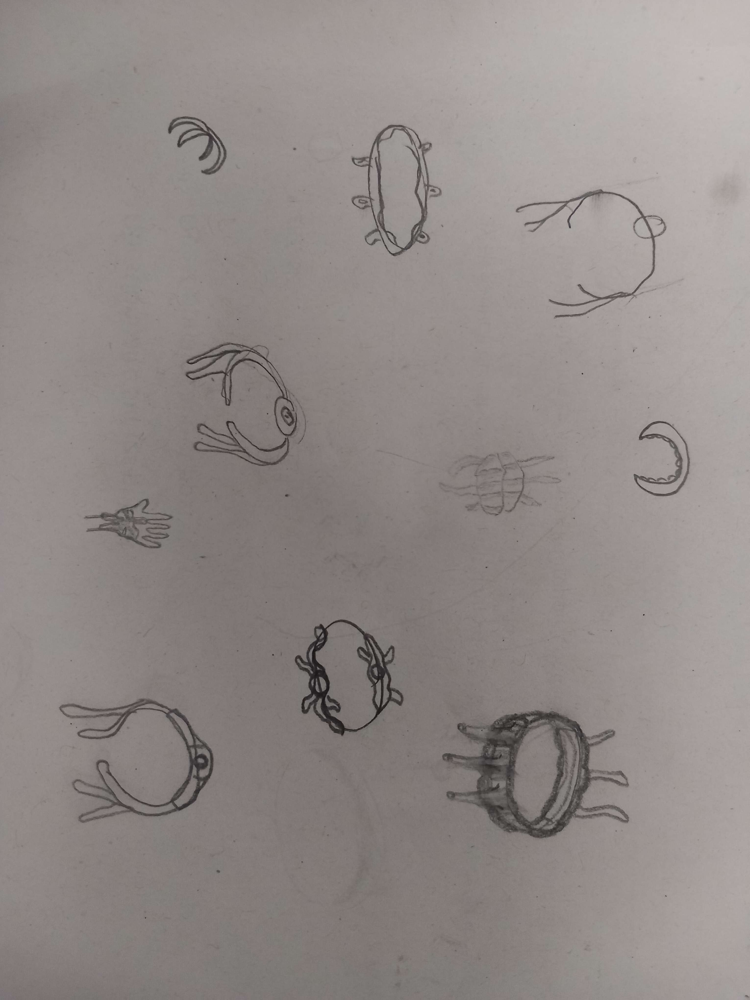
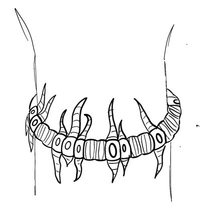
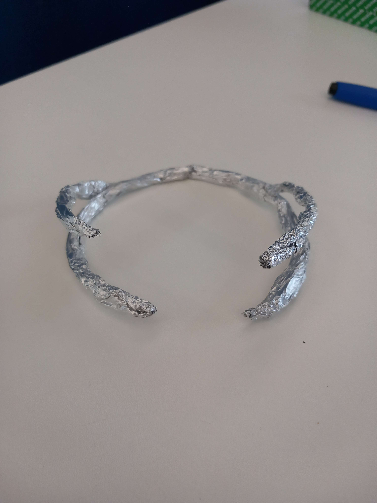
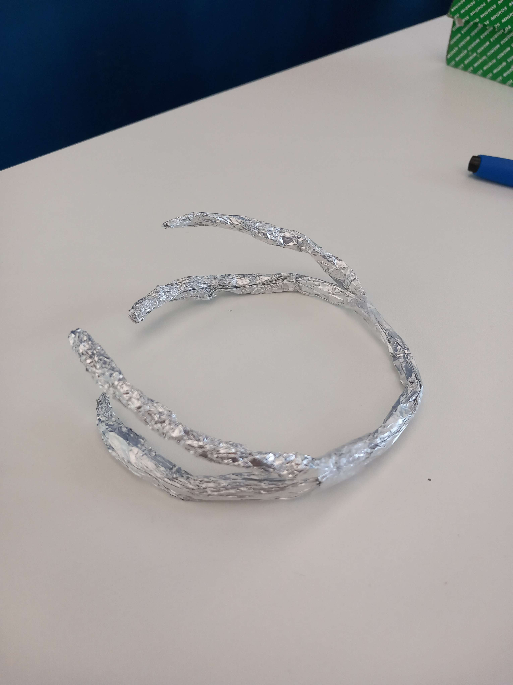
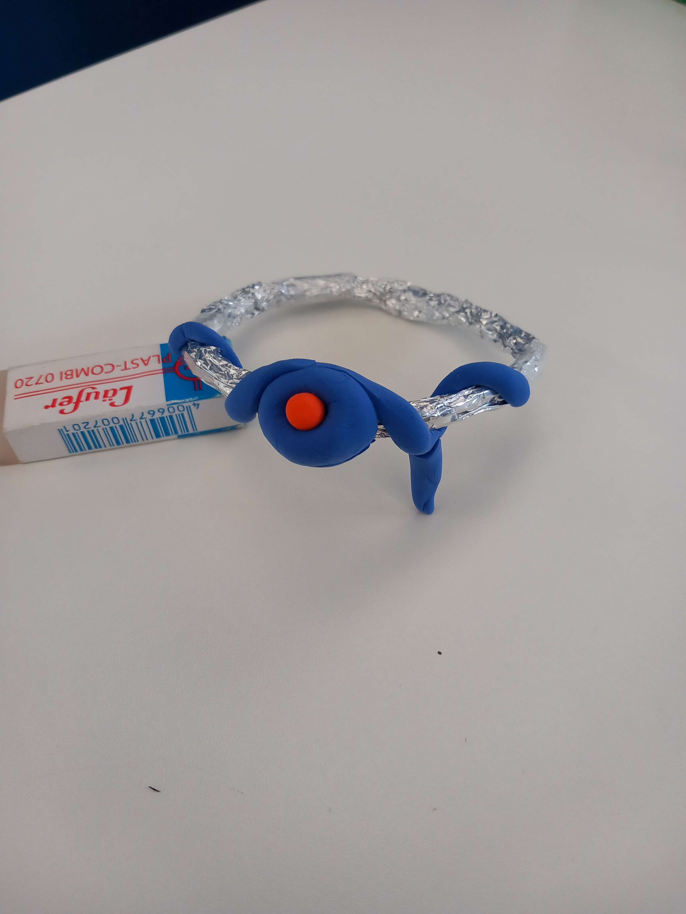
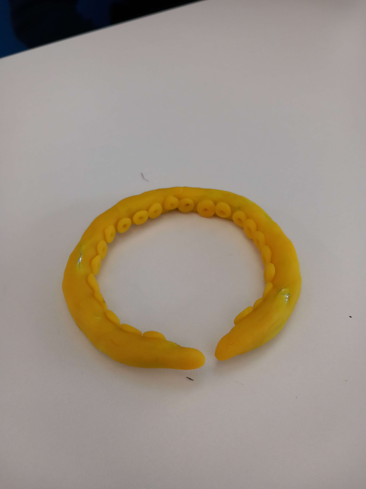

# Object research
*[< **It and I** pitch](../pitches/2022-11-28-pitch.md)*

## Thoughts

### Input & output
 Input → **accelerometer + gyroscope** (MPU-9250) for gesture recognition

 Output → **vibration motors** for haptic feedback (anticipatory or reactive behaviors)

 Secondary output (?) → **LEDs** for visual feedback (global state)

### Shape

- **Swirling, spiral pattern** : symbolize the continuous learning and growth of the person and the creature
- **curved, organic shapes :** sense of movement and fluidity, cycle of constantly learning and adapting to its environment
- **interconnected tentacles or tendrils :** the creature could be imagined as absorbing knowledge through its tendrils, which are connected to you — elongated and flowing, resembling a tentacle or limb, to symbolize the creature's presence and connection
- (**tree or plant patterns :** idea of growing *(but too linear i guess?))*

### Materials
- *soft, flexible material and abstract, undefined shape - to represent the creature's fluid and ever-changing nature*
- **Sillicon** : reflects the organic componant of that beeing that accompagny you - an alive beeing
- **Soft fabric, fur :** ?

## Inspirations

## Drawings

  
  
  
  

## Prototypes
  
  
  
  
  
  
  
  
  
  ## 3D Models
  
    
    
    
    
    
  