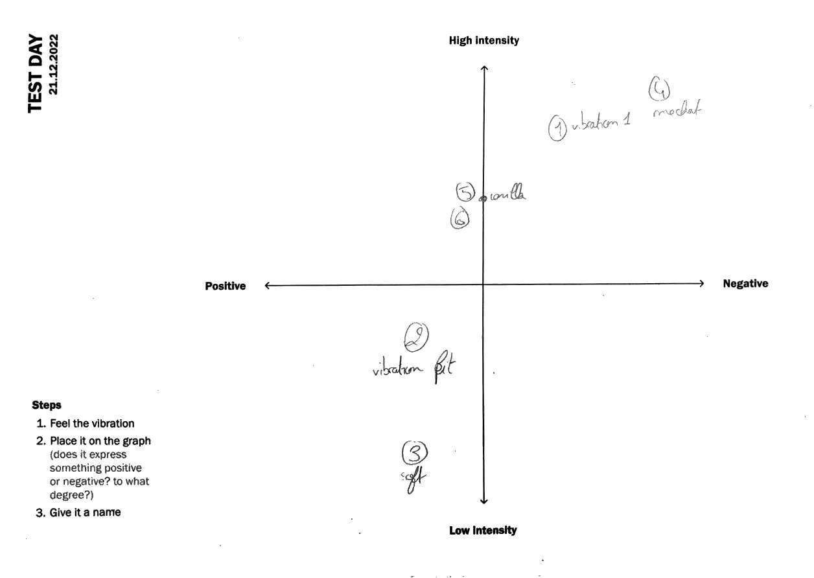
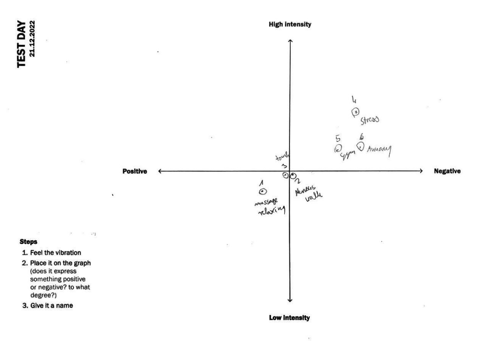
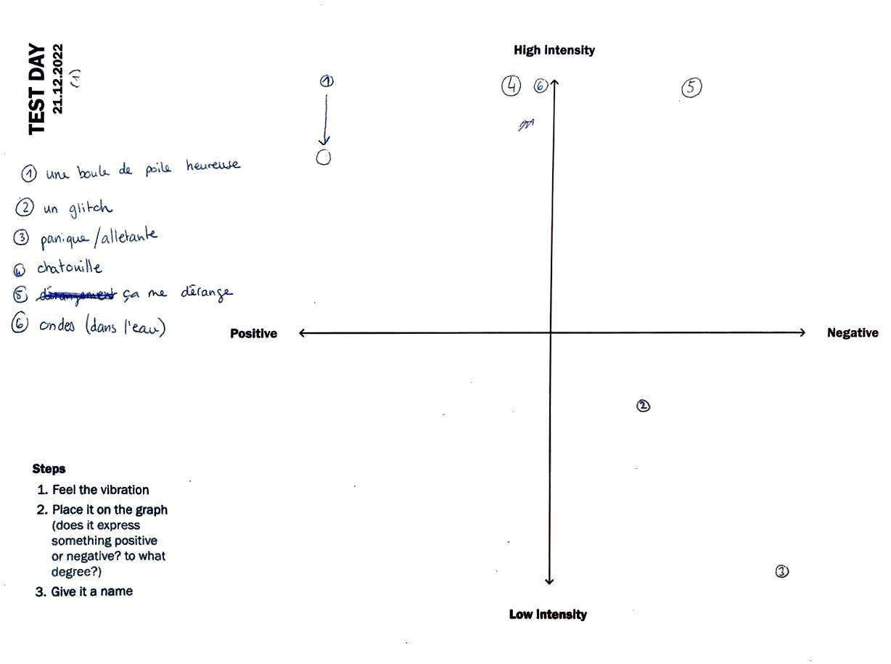
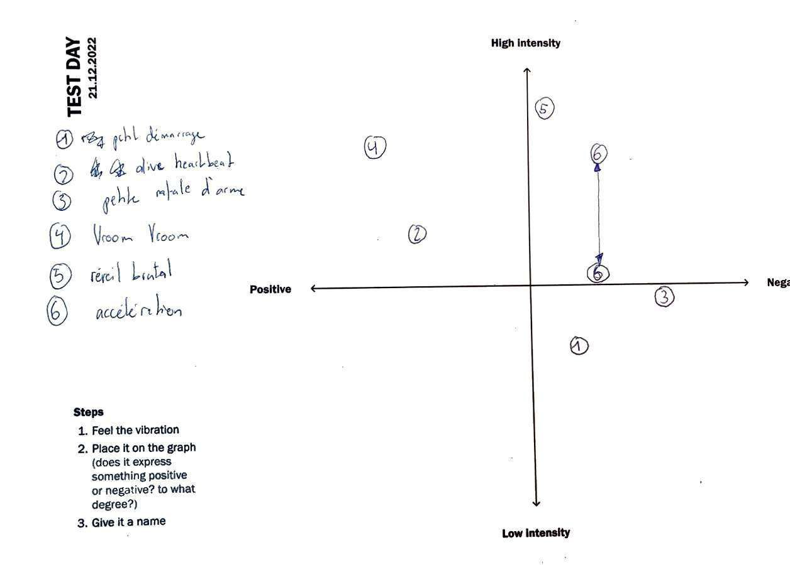
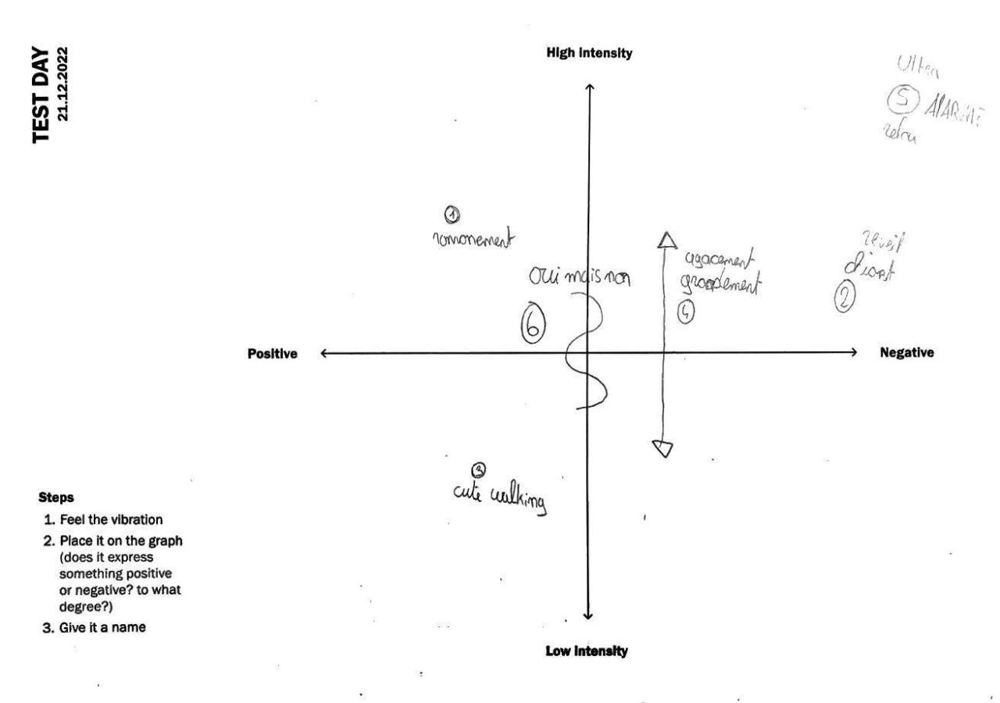

# Test Day

*[< **It and I** pitch](../pitches/2022-11-28-pitch.md)*

I've asked other students to help me test my concept through a little experiment. I've prepared 6 vibration patterns to which I attributed emotions or feelings. The other students were asked to feel each vibration and place them on a 2 axis graph (high intensity vs low intensity - positive vs negative) and give it a name. After that, I've explained them the concept and we discussed about it.

## Insights

### Regarding the project
- **TODO** : analyze the results, see which vibrations worked or not, see which names people gave to the vibrations and understand why, see how they can be replicated to transmit the correct emotion or feeling.
- The vibrations that indicate that *It* is *happy* could be repeated fewer times than when it's *angry* to avoid making them annoying, but it could also be a good thing to make the *angry* ones annoying throught more repetitions to make them more memorable and significant.
- I could search which objects in our daily lives vibrate to inspire myself to make vibrations that can easily connect with what people already know (p.ex alarm clock, phone, etc.)
- Adding a light (representing the global state of *It*) in addition to the vibration seems to be, as suspected, necessary to help the user decipher the meaning of the vibrations, since some people can interpret some vibrations in different ways.
- An alternative to randomizing the initial preferencies of *It* could be to make differents *It* personnalities (lazy, shy, outgoing, aggressive, irresponsible) and choose randomly one of them when the user first interact with the project. This way, the user would have a better understanding of the meaning of the vibrations and the way *It* reacts, giving its personnality more consistency (but could also be too cliche).

### Regarding the methodology
- The order of the vibrations could be randomized for each participant to avoid biais coming from the order of the vibrations.
- In order to provide a sense of what the global scale of the vibration is, it is better to let them feel all vibrations and then make a second round when they place them on the graph.

## Results

