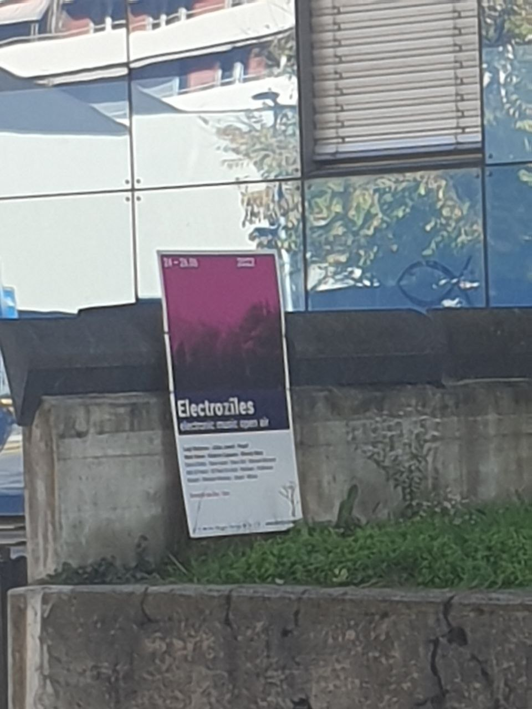
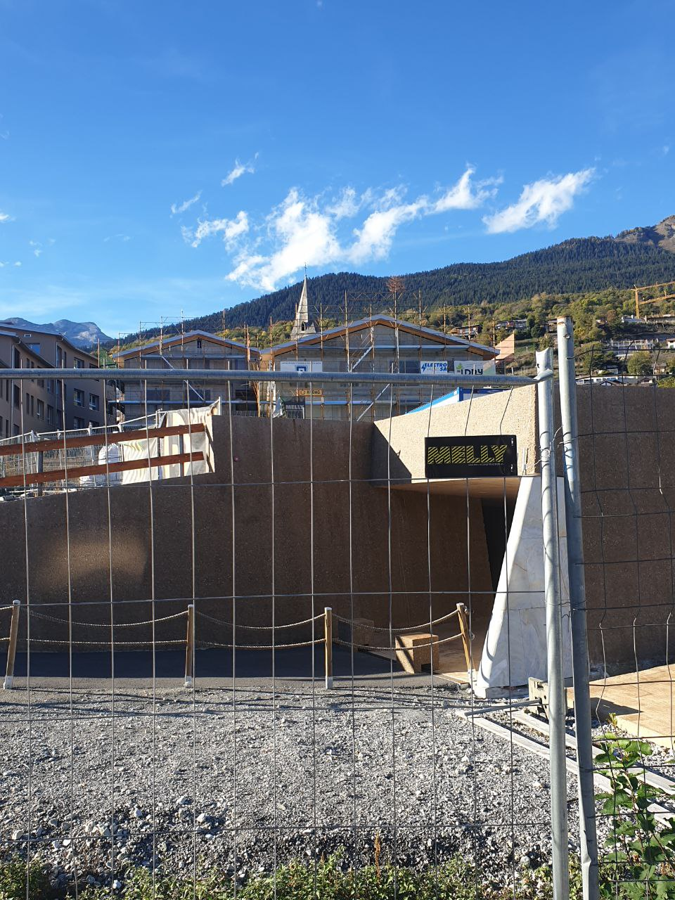

# Observations

## Photos
Here are photographs of everything that made me think of time while going around on a saturday afternoon.

  
  
  
  
  
  
  
  
  
  
  
  
  
  
  
  
  
  
  
  
  
    
    
    

## Phone time check
Comparaison with Nathan :

## Time perception
### Interviews
I asked two friends about their perception of time.

---
**Répond par un mot à temps**

> espace (-temps)

> écoulement

> vie

**Définis le temps comme tu le souhaites**
> C’est chaud comme question. J’imagine comme un cours d’eau, un fleuve géant. Y’a des trucs qui flottent ou des animaux dedans… c’est des personnes qui sont dans le courant et qui avancent ensemble.

> C'est une notion un peu abstraite qui permet d'expliquer beaucoup de choses, à la fois intangible et omniprésente.

**Est-ce que tu aurais quelque chose à dire de ta perception du temps?**
> J’ai le sentiment que ça va vite. Souvent, j’essaie de prendre un point dans le temps où j’en suis, et je calcule combien  de temps il me reste pour accomplir des choses avant qu’il soit trop tard. Les années sont une bonne mesure du temps, là je me dis que j’ai 30 ans et je suis à la moitié, car je considère que même à 60 ans je serai bien. Jusqu’à mes 15 ans, j’ai pas eu le temps de faire des choses intéressantes étant enfant, donc maintenant j’ai pas encore fait trop la moitié (jusqu’aux 60 ans) et j’ai encore le double de temps que je pourrais utiliser.

> Elle est variable selon les moments. Globalement dans ma vie, j’ai l’impression que le temps passe plus vite. Une année maintenant, c’est comme trois mois quand j’avais 10 ans. 

**À quoi est-ce que tu associerais une seconde?**
> Le nombre d’oscillation d’un atome ultra stable. *(visiblement ce qui a donné la seconde)*

> Le temps que je prend pour battre le rythme avec mon doigt.

> Quelque chose de petit, un instant.

**Une minute?**
> Le temps à disposition où les joueurs peuvent discuter dans DnD quand le MJ a fini un round de combat.

> Une pomme, quelque chose d’assez rond, plus costaux qu’une seconde.

**Une heure?**
> Le temps exact que je mets en transports en commun pour rentrer chez moi si je prend le trajet le plus rapide, et quand j’arrive à le prendre, j’ai un sentiment de satisfaction d’être arrivé plus vite!

> Quelque chose de chiant, lent, embêtant.

**Un jour?**
> Y’a des jours qui passent plus lentement que les autres. Par exemples les weekends c’est pas des “vrais jours” en comparaison à des jours où tu dois être actif.

> Je pense aux sept jours la semaine.

**Une semaine?**
> C’est un quotidien. Si c’est une semaine de vacances j’aurais pas l’impression que ce soit une semaine, soit plus long soit plus court selon le contexte, j’aurais plus l’impression d’une semaine quand je suis dans un train train quotidien.

> Dans ma tête c’est comme une bande de vieux films de cinéma, c’est les semaines qui se suivent dans une année.

---

**Interesting points** 
Après avoir discuté, certains éléments intéressants sont ressortis :
- La routine : 
> C'est comme s'il y avait des jalons qui permettent de facilement se repérer. Pour moi le cours du mercredi soir est un jalon qui permet de savoir que j'arrive à la fin de la semaine. Si tu enlèves ces jalons, il est plus difficile de se repérer dans le temps et tu te trompes quand t'essaies de te souvenir de quel jour c'est.
- Changement d'avis : 
> Je n'ai plus trop la même vision qu'avant. Le fleuve de quelques courbes et virages dans lequel tout le monde suit le même "temps" est trop linéaire, maintenant je m'imaginerais plus quelque chose avec comme des checkpoints différents pour chacun.

### Videos
**To watch**
- https://www.youtube.com/watch?v=zHL9GP_B30E

## Time travel
**Definition** 
Time travel is the concept of **movement between certain points in time** by an object or a person, typically with the use of a hypothetical device known as **time machine**. ([Source](https://en.wikipedia.org/wiki/Time_travel))

**Interesting points**
- Time travel, if it is possible, raises questions about causality. Causality is the fact that one thing, the cause, leads to another, the effect (cf. grandfather paradox).
- Within the framework of the theory of general relativity, it would be possible to travel in the past. As time is relative, travelling faster than the speed of light could allow us to go back in time by the use of spacetime geometrics such as a traversable wormhole (hypothetical object which would connect two distinct sheets or two distinct regions of the space-time and would appear, on one side, as a black hole and, on the other side, as a white hole).
- The self-consistency philosophical principle of Novikov states that any actions taken by a time traveler were already part of the history all along. Therefore it's impossible to change history in any way.

**Web**
- [Wayback Machine](https://archive.org/web/) → web archive
- [Wiby](https://wiby.me/) → old sites search engine
- [OoCities](http://www.oocities.org/) → GeoCities.com archives

Why do people use them? Archive research? Nostalgia?

## Loops
### Causal loops
**Definition** 
Theoretical proposition where, by retrocausality or time travel, an event is the cause of another event which is itself the cause of the first. ([Source](https://en.wikipedia.org/wiki/Causal_loop))

**Interesting points**
- Self-fulfilling prophecies can be a form of causality loops. It means that if someone expect something to happen, the person's behavior will be influenced to fullfil the belief (cf. Oedipus).

### Time loops
Time loops are often used as plot devices in fiction. Characters experience the same span of time multiple times. The difference between causal loops and time loops are that causal loops are unchanging. ([Source](https://en.wikipedia.org/wiki/Time_loop))
- The goal is often with the hope to break the loop.
- The loop if often restarted when a specific event happen.

**Interesting points**
- Time loops can be used as puzzles. The character learns from each loop to fully master its environment and thus can put an end to the cycle (cf. Majora's Mask, Minit, Outer Wilds, 12 Minutes, Deathloop).
