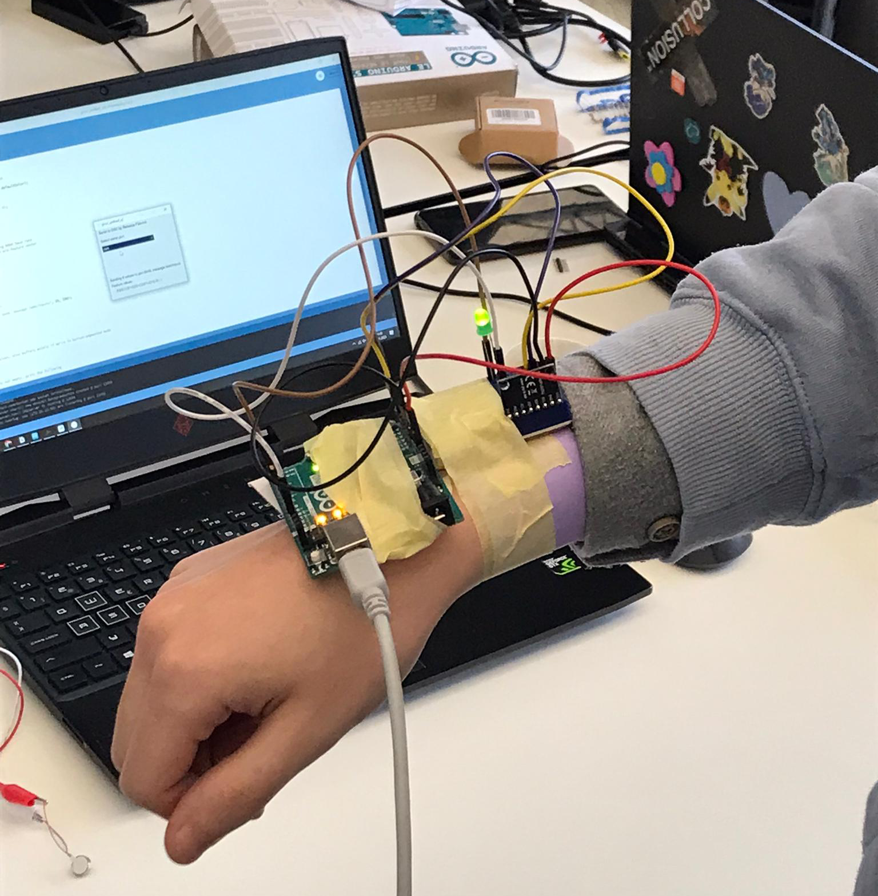

# Electronic Prototype
*[< **It and I** pitch](../../pitches/2022-11-28-pitch.md)*

## First prototype
**Goal : test the input**

Components used :
- Arudino Uno
- MPU-6050 accelerometer + gyroscope

## Second prototype
**Goal : test the output**

Components used :
- Arudino Uno
- 1 vibration motor

## Third prototype
**Goal : bring together input and output**

Components used :
- Arudino Uno
- GY-521 accelerometer + gyroscope
- 1 vibration motor

## Fourth prototype
**Goal : test the input and output using gesture recognition instead of fake logic**

Components used :
- Arudino Uno
- GY-521 accelerometer + gyroscope
- 1 vibration motor
- 1 LED

