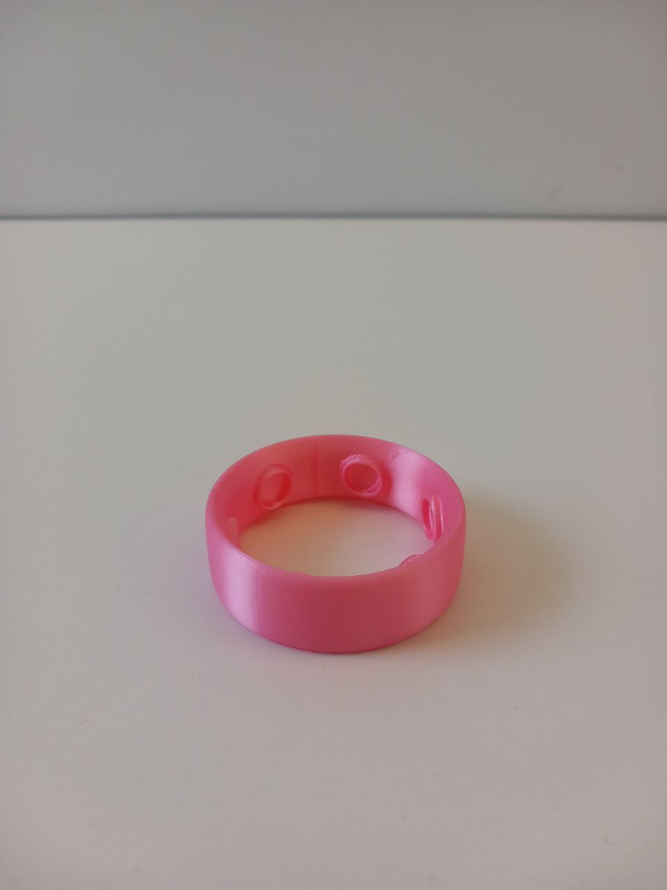
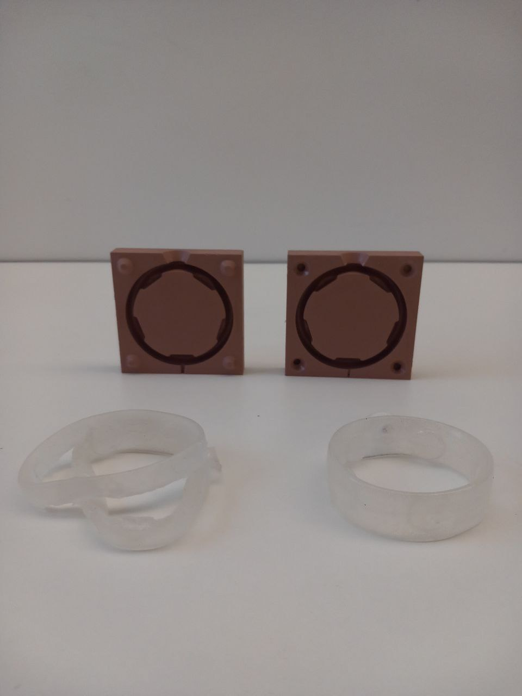

# Object prototyping

## First 3D prototype

An early version of the object has been printed in order to get an idea of what the object would physically look like and feel.
Since then, the object model has slightly changed, but this 3D printed version it allowed me to validate the direction in which I wanted to go.

## Mold and casting

A first approach to realize the object 1-1 to present was to use a mold and liquid pastisol ([plastibait](https://breizhbaits.com/fr/plastibaits/8-plastibaits-medium-shore.html?&yoReviewsPage=6)). The mold has been made using cast polyurethane. One problem has been that this material is too adhesive to the pastisol, so it was difficult to remove the pastisol from the mold. It resulted in objects broken in two. Then, paraffin oil has been used to make the demoulding easier, but the objects where still deformed. Plus, the pastisol used was too flexible and its texture wasn't pleasant to touch. Overall, this approach was not successful.

